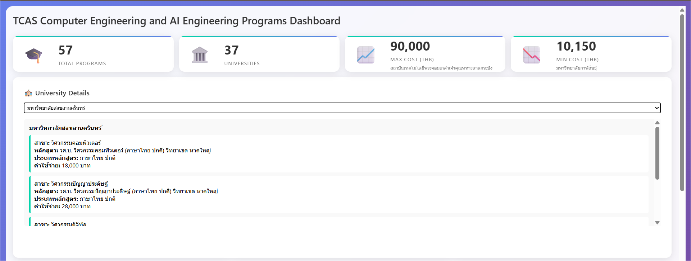

# TCAS Engineering Programs Dashboard 🎓

โปรเจคนี้เป็นระบบ Dashboard สำหรับแสดงข้อมูลหลักสูตรด้านวิศวกรรมศาสตร์ของไทยจากระบบ TCAS พร้อมระบบ web scraping และการวิเคราะห์ข้อมูล

## 👥 ผู้จัดทำ

- **ชื่อ**: นายอับดาร์ เอียดวารี
- **รหัสนักศึกษา**: 6510110541
- **สาขาวิชา**: วิศวกรรมปัญญาประดิษฐ์
- **สถาบัน**: มหาวิทยาลัยสงขลานครินทร์ คณะวิศวกรรมศาสตร์
- **อีเมล**: Abdar012@gmail.com

## 📋 คุณสมบัติหลัก

- **Web Scraping**: ดึงข้อมูลหลักสูตรวิศวกรรมศาสตร์จากเว็บไซต์ TCAS
- **Data Cleaning**: ทำความสะอาดและประมวลผลข้อมูล
- **Interactive Dashboard**: แสดงผลข้อมูลในรูปแบบ charts และ visualizations
- **Data Analysis**: วิเคราะห์ข้อมูลค่าใช้จ่าย มหาวิทยาลัย และหลักสูตร

## 🏗️ โครงสร้างโปรเจค

```
Tcas_CoE_AIE/
├── Data_scrape.py          # สคริปต์สำหรับดึงข้อมูลจากเว็บไซต์
├── cleandata.ipynb         # Jupyter notebook สำหรับทำความสะอาดข้อมูล
├── dashboard.py            # Flask application สำหรับ web dashboard
├── templates/
│   └── dashboard.html      # HTML template สำหรับ dashboard
├── data/
│   ├── tcas_engineering_programs.xlsx    # ข้อมูลดิบ
│   └── tcas_eng_data_cleaned.xlsx       # ข้อมูลที่ทำความสะอาดแล้ว
└── README.md
```

## 🚀 การติดตั้งและการใช้งาน

### ข้อกำหนดเบื้องต้น

- Python 3.7+
- Google Chrome (สำหรับ web scraping)
- ChromeDriver

### การติดตั้ง

1. Clone repository

```bash
git clone https://github.com/abdar/Tcas_CoE_AIE.git
cd Tcas_CoE_AIE
```

2. ติดตั้ง dependencies

```bash
pip install pandas selenium flask openpyxl
```

3. ดาวน์โหลดและติดตั้ง ChromeDriver
   - ดาวน์โหลดจาก: https://chromedriver.chromium.org/
   - ใส่ path ใน system PATH หรือใส่ในโฟลเดอร์โปรเจค

### การใช้งาน

#### 1. Web Scraping

```bash
python Data_scrape.py
```

สคริปต์นี้จะดึงข้อมูลหลักสูตรวิศวกรรมศาสตร์จากเว็บไซต์ TCAS และบันทึกลงไฟล์ Excel

#### 2. Data Cleaning

เปิด `cleandata.ipynb` ใน Jupyter Notebook เพื่อทำความสะอาดและประมวลผลข้อมูล

#### 3. Dashboard

```bash
python dashboard.py
```

เปิดเว็บเบราว์เซอร์ไปที่ `http://localhost:5000` เพื่อดู dashboard

## 📊 ฟีเจอร์ของ Dashboard

- **สถิติทั่วไป**: จำนวนหลักสูตร มหาวิทยาลัย และข้อมูลค่าใช้จ่าย
- **กราฟการกระจายค่าใช้จ่าย**: แสดงการกระจายของค่าเทอมต่างๆ
- **Top Universities**: มหาวิทยาลัยที่มีหลักสูตรมากที่สุด
- **ตารางข้อมูลครบถ้วน**: ข้อมูลหลักสูตรทั้งหมดในรูปแบบตาราง
- **ระบบค้นหา**: ค้นหาหลักสูตรตามชื่อหรือมหาวิทยาลัย

  
  

## 🛠️ เทคโนโลยีที่ใช้

- **Python**: ภาษาหลักในการพัฒนา
- **Selenium**: สำหรับ web scraping
- **Pandas**: สำหรับการจัดการข้อมูล
- **Flask**: สำหรับสร้าง web application
- **Chart.js**: สำหรับสร้าง interactive charts
- **HTML/CSS/JavaScript**: สำหรับ frontend

## 📈 ข้อมูลที่เก็บรวบรวม

- ชื่อหลักสูตร
- ชื่อมหาวิทยาลัย/สถาบัน
- ค่าใช้จ่าย/ค่าเทอม
- ประเภทหลักสูตร
- ข้อมูลเพิ่มเติมอื่นๆ

---

**หมายเหตุ**: โปรเจคนี้พัฒนาขึ้นเพื่อการศึกษาและการวิเคราะห์ข้อมูลการศึกษาในประเทศไทย
